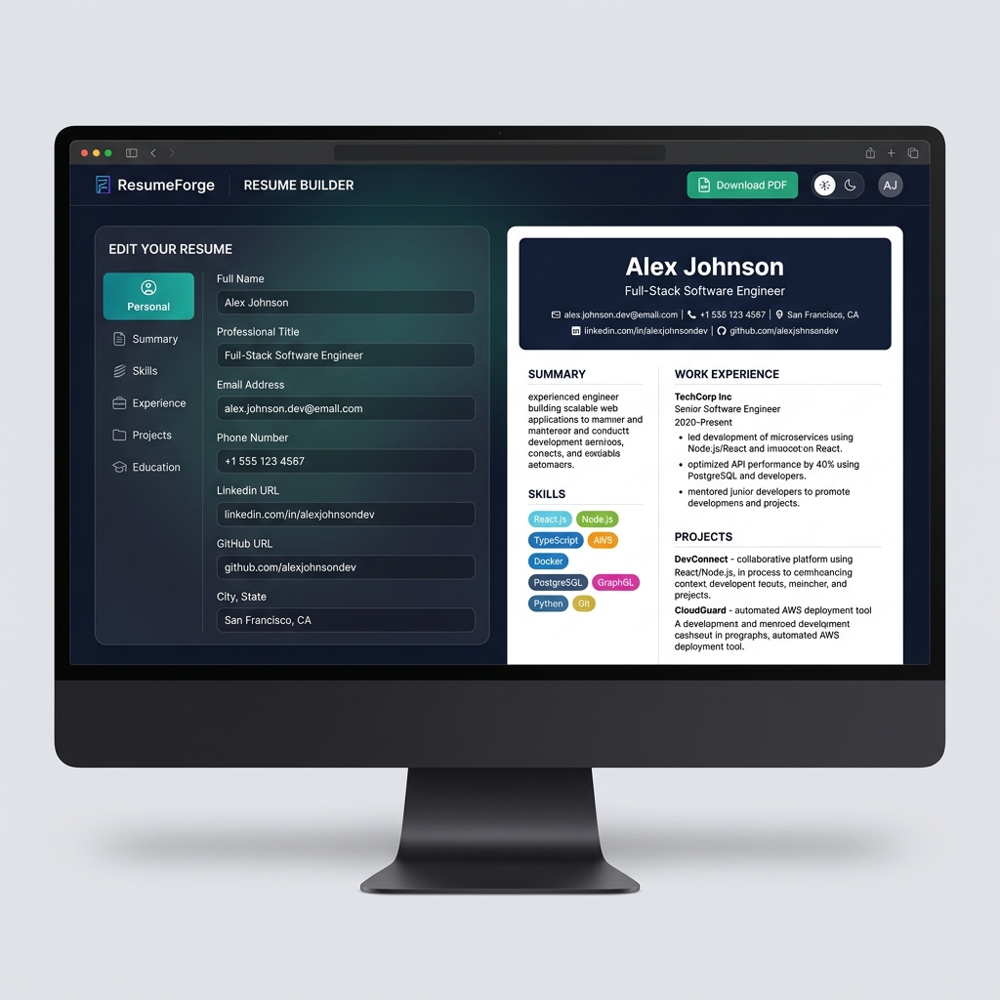
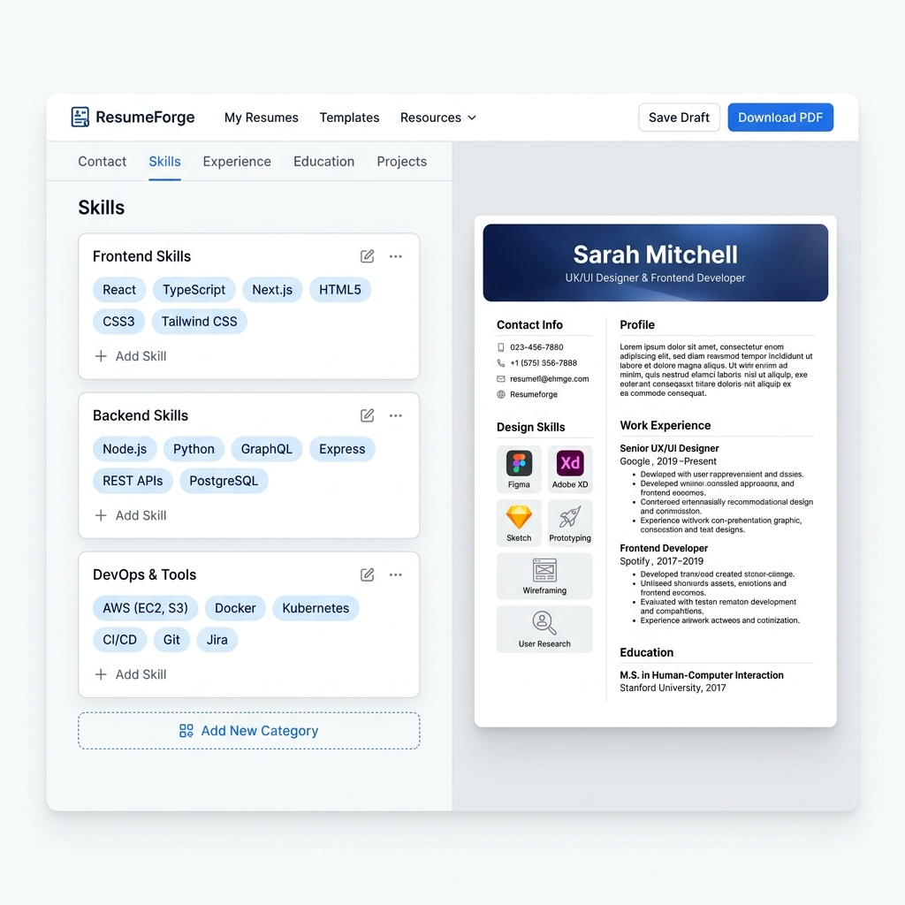

<div align="center">

# 📄 ResumeForge — Professional Resume Builder

**A modern, real-time Resume Builder built with React + Vite.**
Create, edit, and download a professional A4 resume in minutes — no sign-up required!

[](https://github.com/rehan-rathod/resume-builder)
[](https://github.com/rehan-rathod/resume-builder/stargazers)
[](LICENSE)
[](https://react.dev)
[](https://vite.dev)

</div>

---

## 🖼️ Screenshots

### 🌙 Dark Mode — Full-Stack Developer Resume


### ☀️ Light Mode — Designer Resume with Skills Editor


---

## ✨ Features

| Feature | Description |
|---|---|
| 📝 **Live Form Editor** | 6-tab editor — Personal, Summary, Skills, Experience, Projects, Education |
| 👁️ **Real-time A4 Preview** | Resume updates instantly as you type |
| 🏷️ **Skill Tag Builder** | Add/remove skills organized by categories (Frontend, Backend, DevOps...) |
| 📋 **Accordion Sections** | Clean expand/collapse cards for Experience, Projects & Education |
| 💾 **Auto-Save** | Automatically saves to `localStorage` — data persists after refresh |
| 📄 **PDF Export** | One-click "Download PDF" — browser print-to-PDF with proper A4 layout |
| 🌓 **Dark / Light Mode** | Toggle between beautiful dark glassmorphism and clean light theme |
| 🎨 **Demo Data** | Pre-filled with a real demo resume so you see results immediately |

---

## 🚀 Getting Started

### Prerequisites
- Node.js `v18+`
- npm `v9+`

### Installation

```bash
# 1. Clone the repository
git clone https://github.com/rehan-rathod/resume-builder.git

# 2. Go into the project directory
cd resume-builder

# 3. Install dependencies
npm install

# 4. Start the development server
npm run dev
```

Open **[http://localhost:5173](http://localhost:5173)** in your browser. 🎉

---

## 🛠️ Tech Stack

| Technology | Purpose |
|---|---|
| **React 19** | UI Framework |
| **Vite 8** | Build Tool & Dev Server |
| **Vanilla CSS** | Styling (glassmorphism, dark/light themes) |
| **Lucide React** | Icons |
| **localStorage** | Data persistence (no backend needed) |
| **window.print()** | PDF Export |

---

## 📁 Project Structure

```
src/
├── App.jsx                    ← Root — editor + preview split layout
├── index.css                  ← App UI design system (dark/light themes)
├── resume.css                 ← A4 print-safe resume styles
├── data/
│   └── defaultResume.js       ← Demo resume data
└── components/
    ├── Header.jsx             ← App header (logo, theme toggle, PDF button)
    ├── Editor/
    │   ├── EditorPanel.jsx    ← Tab navigation shell
    │   ├── PersonalForm.jsx   ← Name, title, contact info
    │   ├── SummaryForm.jsx    ← Professional summary
    │   ├── SkillsForm.jsx     ← Skill tag builder
    │   ├── ExperienceForm.jsx ← Work history accordion
    │   ├── ProjectsForm.jsx   ← Projects accordion
    │   └── EducationForm.jsx  ← Education accordion
    └── Preview/
        ├── ResumePreview.jsx  ← A4 container
        ├── ResumeHeader.jsx   ← Name, title, contact bar
        ├── ResumeSummary.jsx  ← Summary section
        ├── ResumeSkills.jsx   ← Skills with pills
        ├── ResumeExperience.jsx ← Work experience timeline
        ├── ResumeProjects.jsx ← Projects list
        └── ResumeEducation.jsx ← Education list
```

---

## 📄 How to Export as PDF

1. Click **"Download PDF"** button in the top-right header
2. Browser print dialog opens
3. Set **Destination** → `Save as PDF`
4. Set **Paper size** → `A4`
5. Set **Margins** → `None`
6. Click **Save** ✅

---

## 🎨 Resume Sections

- **Personal Info** — Name, Job Title, Email, Phone, Location, LinkedIn, GitHub, Website
- **Summary** — Professional bio with character counter
- **Skills** — Categorized skill tags (Frontend, Backend, DevOps, etc.)
- **Experience** — Company, Role, Dates, Location, Bullet responsibilities
- **Projects** — Name, Description, Tech stack tags, Live/GitHub link
- **Education** — Institution, Degree, Year, GPA/Grade

---

## 📦 Build for Production

```bash
npm run build
```

Output will be in the `dist/` folder — ready to deploy on **Vercel**, **Netlify**, **GitHub Pages**, etc.

---

## 🙏 Inspiration

Inspired by [awesome-cv-builder](https://github.com/agm1n/awesome-cv-builder) by agm1n — a great CV builder with a clean JSON-driven layout.

---

## 📝 License

MIT License — free to use, modify, and distribute.

---

<div align="center">

Made with ❤️ by **[Rehan Rathod](https://github.com/rehan-rathod)**

⭐ **Star this repo** if you found it useful!

</div>
